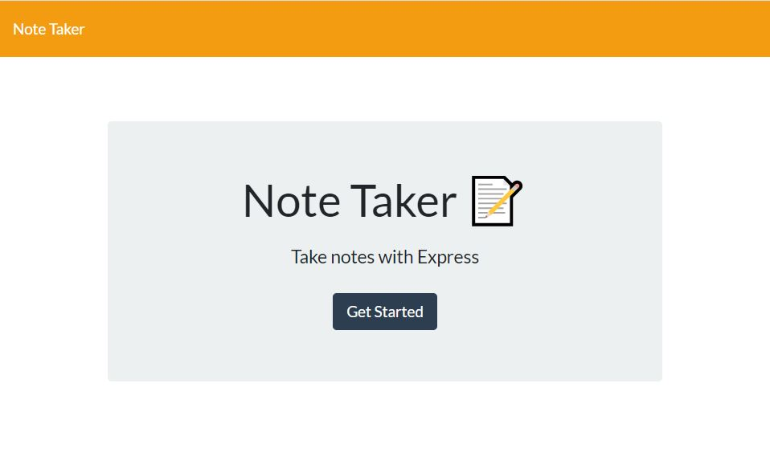
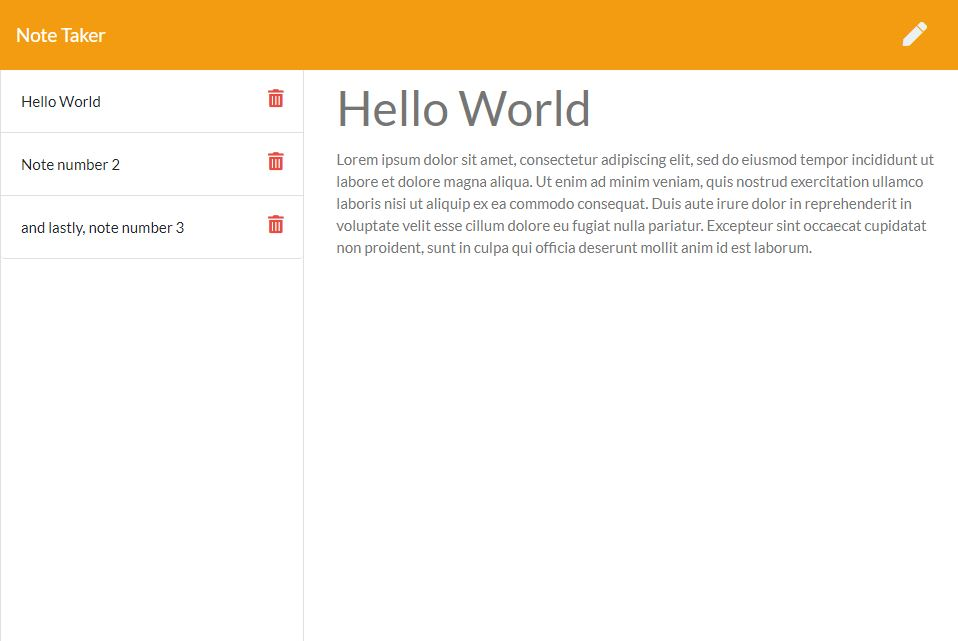

# Note Taker Application

---
## Description:

This note taking application allows the user to create, view, and delete notes as needed. It allows the user to easily organize their thoughts, keep track of task, and anything else they need to keep track of. 

The notes are dynamically created and will appear on the left side of the application. 

---
## Demo:

## Deployed Website

<a href="https://sheltered-savannah-72983.herokuapp.com/">Note Taker Application Link</a>
---
## Instalation:
To use this application you must clone the repository into your local computer. 

`git@github.com:jeanhern81/Note-Taker.git`

Install the required dependencies. To use the application open `localhost:3001` in your browser.

---
## Technologies Used:
* JavaScript
* NodeJS
* Node Packages: 
    * Express

---
## ISC License:

Copyright (c) [2020], [Jeanette Hernandez]

Permission to use, copy, modify, and/or distribute this software for any
purpose with or without fee is hereby granted, provided that the above
copyright notice and this permission notice appear in all copies.

THE SOFTWARE IS PROVIDED "AS IS" AND THE AUTHOR DISCLAIMS ALL WARRANTIES
WITH REGARD TO THIS SOFTWARE INCLUDING ALL IMPLIED WARRANTIES OF
MERCHANTABILITY AND FITNESS. IN NO EVENT SHALL THE AUTHOR BE LIABLE FOR
ANY SPECIAL, DIRECT, INDIRECT, OR CONSEQUENTIAL DAMAGES OR ANY DAMAGES
WHATSOEVER RESULTING FROM LOSS OF USE, DATA OR PROFITS, WHETHER IN AN
ACTION OF CONTRACT, NEGLIGENCE OR OTHER TORTIOUS ACTION, ARISING OUT OF
OR IN CONNECTION WITH THE USE OR PERFORMANCE OF THIS SOFTWARE.

